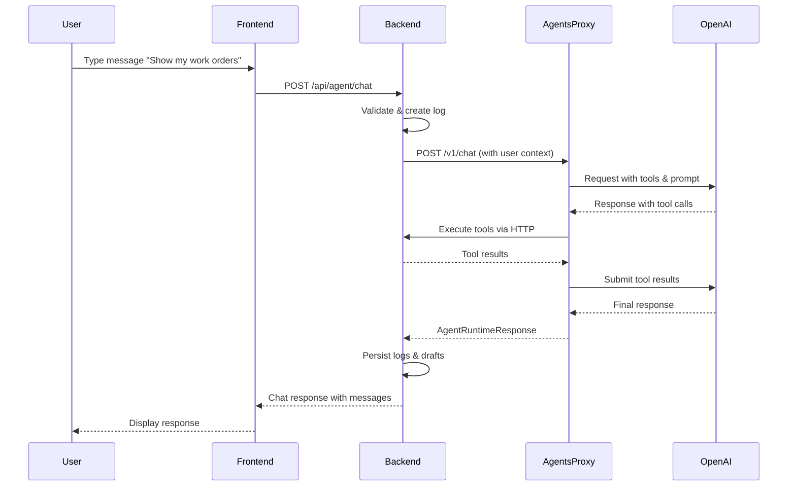

# Agent Feature Documentation

## Overview

The Agent feature is a ChatKit-powered AI assistant integration that enables users to interact with the CMMS system through natural language conversations. The system supports querying data, receiving AI-generated responses, and executing draft actions that require user confirmation.

**Status**: Core infrastructure in place with agents-proxy service. Tool implementations and draft execution require completion.

---

## Architecture

### High-Level Design

```
┌─────────────────┐      ┌─────────────────┐      ┌──────────────────┐      ┌──────────────────┐
│   Frontend      │      │   Backend API   │      │  Agents Proxy    │      │ OpenAI Agents    │
│   (React)       │◄────►│   (Spring Boot) │◄────►│   (Node.js)      │◄────►│   Runtime API    │
└─────────────────┘      └─────────────────┘      └──────────────────┘      └──────────────────┘
       │                          │                         │
       │                          ▼                         │
       │                  ┌──────────────┐                 │
       │                  │  PostgreSQL  │                 │
       │                  │   Database   │                 │
       │                  └──────────────┘                 │
       │                                                    │
       ▼                                                    ▼
┌──────────────────┐                              ┌──────────────────┐
│  Redux Store     │                              │  ChatKit Agent   │
│  (State Mgmt)    │                              │  Configuration   │
└──────────────────┘                              └──────────────────┘
```

### Request Flow



---

## Component Breakdown

### 1. Frontend Layer (`frontend/src`)

**ChatDock Component** (`components/ChatDock/ChatDock.tsx`)
- Floating action button (FAB) to open/close
- Scrollable message transcript
- Draft action cards with confirm/decline buttons
- Tool call summary display
- Real-time loading states and error handling

**Redux State** (`slices/agentChat.ts`)
- State: messages, drafts, toolCalls, sending, error
- Actions: sendPrompt, loadDrafts, confirmDraft, declineDraft
- Thunks handle async API calls

**API Client** (`utils/agentApi.ts`)
- Base URL: `${API_BASE}/api/agent`
- Methods: `postChat`, `getDrafts`, `confirmDraft`, `declineDraft`
- **Fix Applied**: Added `Content-Type: application/json` header to POST requests

**Configuration** (`config.ts`)
- `chatkitEnabled`: Feature flag from env
- `chatkitAgentId`: Agent identifier
- `agentApiBase`: Backend URL (defaults to API_URL)

---

### 2. Backend Layer (`api/src/main/java/com/grash`)

#### AgentController (`controller/AgentController.java`)

**REST Endpoints**:

| Method | Path | Purpose |
|--------|------|---------|
| POST | `/api/agent/chat` | Submit user prompt |
| GET | `/api/agent/drafts` | Get pending drafts |
| POST | `/api/agent/drafts/{id}/confirm` | Approve draft |
| DELETE | `/api/agent/drafts/{id}` | Decline draft |

**Request/Response Flow**:
1. Validates feature enabled (`AGENT_CHATKIT_ENABLED`)
2. Authenticates user via JWT
3. Delegates to `AgentService`
4. Returns 501 NOT_IMPLEMENTED if disabled

#### AgentService (`service/AgentService.java`)

**Core Orchestration Logic**:

```java
public AgentChatResponse handlePrompt(OwnUser user, AgentPromptRequest request) {
    // 1. Resolve agent ID (from request or config)
    // 2. Generate correlation ID for tracing
    // 3. Validate runtime URL configured
    // 4. Build user context metadata
    // 5. Create "queued" log entry
    // 6. Call AgentRuntimeClient
    // 7. Update log to "completed"
    // 8. Persist tool calls and drafts
    // 9. Return unified response
}
```

**Key Methods**:
- `handlePrompt()`: Main orchestration
- `persistToolCalls()`: Save tool invocation logs
- `persistDrafts()`: Create draft action records
- `generateCorrelationId()`: UUID for request tracing

#### AgentRuntimeClient (`service/AgentRuntimeClient.java`)

**HTTP Communication with Agents Proxy**:

**Target Endpoint**: `${AGENT_RUNTIME_URL}/v1/chat`

**HTTP Client**: OkHttp with configurable timeout (default 30s)

**Request Headers**:
```
Content-Type: application/json
X-Correlation-Id: {uuid}
Authorization: Bearer {AGENT_RUNTIME_TOKEN}  (if configured)
```

**Request Body** (`AgentRuntimeRequest`):
```json
{
  "agentId": "chatkit-agent-123",
  "prompt": "Show my open work orders",
  "metadata": {
    "source": "web",
    "messageCount": 3,
    "correlationId": "uuid",
    "userContext": {
      "userId": 123,
      "email": "user@example.com",
      "fullName": "John Doe",
      "role": "Administrator",
      "companyId": 456
    }
  },
  "user": { /* same as userContext */ }
}
```

**Response Body** (`AgentRuntimeResponse`):
```json
{
  "status": "success",
  "sessionId": "runtime-session-abc",
  "messages": [
    {
      "role": "assistant",
      "content": "You have 3 open work orders..."
    }
  ],
  "toolCalls": [
    {
      "toolName": "search_work_orders",
      "arguments": { "status": "open" },
      "resultCount": 3,
      "status": "success"
    }
  ],
  "drafts": [
    {
      "agentSessionId": "session-123",
      "operationType": "close_work_order",
      "summary": "Close work order #123",
      "payload": {
        "workOrderId": 123,
        "status": "COMPLETE"
      }
    }
  ]
}
```

**Error Handling**:
- Non-2xx status → `AgentRuntimeException`
- Empty response → Exception
- Timeout → OkHttp timeout exception
- Network errors → Exception with cause

#### AgentToolRegistry (`service/AgentToolRegistry.java`)

**Utility Service**:
- `serializeArguments()`: Convert Map to JSON string
- `getUserContext()`: Build user metadata map

**⚠️ Note**: No tool implementations yet. This is a utility class, not an actual tool registry.

#### AgentDraftService (`service/AgentDraftService.java`)

**Draft Lifecycle Management**:

```java
public AgentDraftActionResponse confirmDraft(Long draftId, Long userId) {
    AgentDraftAction draft = findDraftByIdAndUser(draftId, userId);
    draft.setStatus("confirmed");
    draft.setUpdatedAt(Instant.now());
    return toResponse(draftActionRepository.save(draft));

    // ⚠️ MISSING: Actual action execution
}
```

**Methods**:
- `getPendingDrafts(userId)`: Query pending drafts
- `confirmDraft(draftId, userId)`: Mark as confirmed
- `declineDraft(draftId, userId)`: Mark as declined

---

### 3. Agents Proxy (`agents-proxy/`)

**Technology**: Node.js + Express.js

**Purpose**: Mediates between backend and OpenAI Agents runtime

**Key Files**:
- `src/index.js`: Main Express server
- `package.json`: Dependencies (@openai/agents, express, axios)
- `.env.example`: Configuration template

**Endpoint**: `POST /v1/chat`

**Request Handler**:
```javascript
app.post('/v1/chat', async (req, res) => {
  const { agentId, prompt, metadata, user } = req.body;

  // 1. Initialize OpenAI Agents client
  // 2. Send prompt with user context
  // 3. Handle tool executions (call backend)
  // 4. Stream or batch responses
  // 5. Return final response with messages, toolCalls, drafts
});
```

**Tool Execution Flow**:
1. OpenAI requests tool execution
2. Proxy calls backend endpoints (e.g., `/api/work-orders/search`)
3. Backend returns data (filtered by user's company)
4. Proxy formats results for OpenAI
5. OpenAI generates natural language response

**Configuration** (`.env`):
```env
PORT=4005
API_BASE=http://api:8080
OPENAI_API_KEY=sk-...
AGENT_CHATKIT_AGENT_ID=agent-123
```

**Docker Integration**:
```yaml
agents-proxy:
  build: ./agents-proxy
  container_name: atlas-agents-proxy
  environment:
    PORT: 4005
    API_BASE: http://api:8080
    OPENAI_API_KEY: ${OPENAI_API_KEY}
  ports:
    - "4005:4005"
  depends_on:
    - api
```

---

### 4. Database Layer

#### Table: `agent_tool_invocation_log`

**Purpose**: Audit trail for all tool invocations

| Column | Type | Description |
|--------|------|-------------|
| id | bigserial | Primary key |
| created_at | timestamp | Invocation time |
| user_id | bigint | User who triggered |
| company_id | bigint | Company context |
| tool_name | varchar(100) | Tool identifier |
| arguments_json | text | Tool input parameters |
| result_count | integer | Number of results |
| status | varchar(50) | success/failed/queued |
| correlation_id | varchar(100) | Request grouping |

**Indexes**:
- `idx_agent_tool_log_user` on user_id
- `idx_agent_tool_log_company` on company_id
- `idx_agent_tool_log_status` on status

#### Table: `agent_draft_action`

**Purpose**: Pending actions requiring user confirmation

| Column | Type | Description |
|--------|------|-------------|
| id | bigserial | Primary key |
| created_at | timestamp | Creation time |
| updated_at | timestamp | Last modification |
| user_id | bigint | Draft owner |
| company_id | bigint | Company context |
| agent_session_id | varchar(100) | Runtime session |
| operation_type | varchar(100) | Action type |
| payload | text | JSON action details |
| status | varchar(50) | pending/confirmed/declined |

**Payload Structure**:
```json
{
  "summary": "Close work order #123",
  "data": {
    "workOrderId": 123,
    "completionNotes": "Resolved by agent"
  }
}
```

**Status Flow**: `pending → confirmed | declined`

---

## Configuration

### Backend Configuration

**File**: `api/src/main/resources/application.yml`

```yaml
agent:
  chatkit-enabled: ${AGENT_CHATKIT_ENABLED:false}
  chatkit-agent-id: ${AGENT_CHATKIT_AGENT_ID:}
  runtime-url: ${AGENT_RUNTIME_URL:http://agents-proxy:4005}
  runtime-token: ${AGENT_RUNTIME_TOKEN:}
  timeout-ms: ${AGENT_TIMEOUT_MS:30000}
  max-tool-results: ${AGENT_MAX_TOOL_RESULTS:50}
```

**Environment Variables** (`.env`):
```env
# Backend
AGENT_CHATKIT_ENABLED=true
AGENT_CHATKIT_AGENT_ID=agent-123
AGENT_RUNTIME_URL=http://agents-proxy:4005
AGENT_RUNTIME_TOKEN=optional-bearer-token
AGENT_TIMEOUT_MS=30000
AGENT_MAX_TOOL_RESULTS=50

# Agents Proxy
OPENAI_API_KEY=sk-proj-...
AGENTS_PROXY_PORT=4005
```

**Property Descriptions**:
- `chatkit-enabled`: Master feature flag (returns 501 when false)
- `chatkit-agent-id`: Default OpenAI agent identifier
- `runtime-url`: Agents proxy base URL
- `runtime-token`: Optional authentication for proxy
- `timeout-ms`: HTTP request timeout (milliseconds)
- `max-tool-results`: Result limit per tool (not enforced yet)

### Frontend Configuration

**File**: `frontend/src/config.ts`

```typescript
export const chatkitEnabled = getRuntimeValue('CHATKIT_ENABLED') === 'true';
export const chatkitAgentId = getRuntimeValue('CHATKIT_AGENT_ID');
export const agentApiBase = getRuntimeValue('AGENT_API_BASE') || apiUrl;
```

**Environment Variables**:
```env
REACT_APP_CHATKIT_ENABLED=true
REACT_APP_CHATKIT_AGENT_ID=agent-123
REACT_APP_AGENT_API_BASE=http://localhost:8080
```

**Runtime Configuration**: Values injected at container startup via `public/runtime-env.js`

### Docker Compose Configuration

```yaml
services:
  api:
    environment:
      AGENT_CHATKIT_ENABLED: ${AGENT_CHATKIT_ENABLED:-false}
      AGENT_RUNTIME_URL: ${AGENT_RUNTIME_URL:-http://agents-proxy:4005}
      AGENT_RUNTIME_TOKEN: ${AGENT_RUNTIME_TOKEN:-}

  frontend:
    environment:
      CHATKIT_ENABLED: ${CHATKIT_ENABLED:-false}
      CHATKIT_AGENT_ID: ${CHATKIT_AGENT_ID:-}
      AGENT_API_BASE: ${AGENT_API_BASE:-http://localhost:8080}

  agents-proxy:
    build: ./agents-proxy
    environment:
      PORT: 4005
      API_BASE: http://api:8080
      OPENAI_API_KEY: ${OPENAI_API_KEY:-}
    ports:
      - "4005:4005"
```

---

## API Reference

### Backend Endpoints

#### POST `/api/agent/chat`

**Purpose**: Submit user prompt and receive AI response

**Headers**:
- `Authorization: Bearer {jwt-token}`
- `Content-Type: application/json`

**Request**:
```json
{
  "agentId": "agent-123",
  "prompt": "Show my open work orders",
  "metadata": {
    "source": "web",
    "messageCount": 3
  }
}
```

**Response (200 OK)**:
```json
{
  "status": "success",
  "agentId": "agent-123",
  "correlationId": "uuid",
  "sessionId": "session-abc",
  "messages": [
    {
      "role": "assistant",
      "content": "You have 3 open work orders..."
    }
  ],
  "toolCalls": [
    {
      "toolName": "search_work_orders",
      "arguments": { "status": "open" },
      "resultCount": 3,
      "status": "success"
    }
  ],
  "drafts": [
    {
      "id": 42,
      "operationType": "close_work_order",
      "payload": "{\"summary\":\"Close WO #123\"}",
      "status": "pending"
    }
  ]
}
```

**Error Responses**:
- 501 NOT_IMPLEMENTED: Feature disabled
- 400 BAD_REQUEST: Invalid request
- 500 INTERNAL_SERVER_ERROR: Runtime failure

#### GET `/api/agent/drafts`

**Purpose**: Get user's pending draft actions

**Response**:
```json
[
  {
    "id": 42,
    "agentSessionId": "session-123",
    "operationType": "close_work_order",
    "payload": "{\"summary\":\"Close WO #123\",\"data\":{\"workOrderId\":123}}",
    "status": "pending",
    "createdAt": "2025-10-10T14:30:00Z"
  }
]
```

#### POST `/api/agent/drafts/{id}/confirm`

**Purpose**: Approve draft action

**Response**: Updated draft with `status: "confirmed"`

**⚠️ Current Limitation**: Status updated but action not executed

#### DELETE `/api/agent/drafts/{id}`

**Purpose**: Decline draft action

**Response**: Updated draft with `status: "declined"`

### Agents Proxy Endpoint

#### POST `/v1/chat`

**Purpose**: Process agent prompt with OpenAI integration

**Request**:
```json
{
  "agentId": "agent-123",
  "prompt": "Show my work orders",
  "user": {
    "userId": 123,
    "companyId": 456
  }
}
```

**Response**: Same as backend `/api/agent/chat` response

---

## Implementation Status

### ✅ Completed

- Database schema (migrations applied)
- Backend REST endpoints
- Frontend ChatDock UI component
- Redux state management
- Agents proxy service (Node.js + Express)
- HTTP client for runtime communication
- Feature flag system
- User authentication & authorization
- Correlation ID tracing
- Tool invocation logging
- Draft action persistence

### ⚠️ Partially Implemented

- **Session Management**: Session IDs tracked but not used for conversation history
- **Error Handling**: Basic error handling, no retry logic
- **Tool Registry**: Utility methods exist but no actual tools registered

### ❌ Not Implemented (Critical)

1. **Tool Implementations** 🔴
   - No actual CMMS tools (search_work_orders, get_asset, etc.)
   - Tools must query backend endpoints and return results
   - Must enforce multi-tenancy (filter by company_id)

2. **Draft Action Execution** 🔴
   - Confirmed drafts update database but don't execute actions
   - Need operation dispatcher (close_work_order → WorkOrderService.close())
   - Must validate permissions and handle errors

3. **Multi-Tenancy Enforcement** 🔴
   - SECURITY RISK: Tools must filter by user's company
   - Need validation in tool execution layer
   - Critical for production deployment

### ❌ Not Implemented (Important)

- Conversation history persistence
- Retry logic with exponential backoff
- User feedback after draft execution
- Draft validation before execution
- Rate limiting per user/company
- Tool result limiting enforcement
- Analytics dashboard
- Comprehensive test coverage

---

## Security Considerations

### ✅ Implemented
- JWT authentication on all endpoints
- User ID validation (drafts belong to user)
- Feature flag to disable system
- HTTPS support for runtime communication

### ❌ Missing (Critical)
- **Multi-tenancy enforcement in tools** 🔴
- Tool-level permission checks
- Input sanitization for tool parameters
- Output sanitization for agent responses
- Rate limiting
- Audit logging of confirmed actions
- Cost monitoring

### Recommendations
1. All tool queries MUST filter by `user.company.id`
2. Implement permission checks per tool
3. Sanitize all user inputs before passing to OpenAI
4. Rate limit requests per user (e.g., 10/minute)
5. Log all draft confirmations for audit trail

---

## Troubleshooting

### Common Issues

**1. "fetch failed" Error**
- **Cause**: Missing `Content-Type: application/json` header
- **Fix**: Applied in `frontend/src/utils/agentApi.ts:40-48`
- **Rebuild**: `docker-compose build frontend --no-cache`

**2. "Feature disabled" Message**
- **Cause**: `AGENT_CHATKIT_ENABLED=false` or not set
- **Fix**: Set to `true` in `.env` file
- **Restart**: `docker-compose restart api`

**3. "Runtime URL not configured"**
- **Cause**: `AGENT_RUNTIME_URL` not set
- **Fix**: Set to `http://agents-proxy:4005` (Docker) or `http://localhost:4005` (local)

**4. Agents Proxy Not Starting**
- **Cause**: Missing `OPENAI_API_KEY`
- **Fix**: Get API key from OpenAI platform
- **Set**: Add to `.env` file

**5. Tools Return No Data**
- **Cause**: Tools not implemented yet
- **Status**: Requires development work

### Debug Checklist

- [ ] Backend: `AGENT_CHATKIT_ENABLED=true`
- [ ] Frontend: `CHATKIT_ENABLED=true`
- [ ] Agents proxy running on port 4005
- [ ] `OPENAI_API_KEY` configured
- [ ] Database migrations applied
- [ ] Frontend rebuilt after config changes

### Logs to Check

**Backend Logs**:
```bash
docker-compose logs -f api | grep -i agent
```

**Agents Proxy Logs**:
```bash
docker-compose logs -f agents-proxy
```

**Database Logs** (tool invocations):
```sql
SELECT * FROM agent_tool_invocation_log
ORDER BY created_at DESC LIMIT 10;
```

---

## Development Roadmap

### Phase 1: Core Tools (Week 1-2)
1. Implement `search_work_orders` tool
2. Implement `get_work_order_details` tool
3. Implement `search_assets` tool
4. Implement `search_parts` tool
5. Add multi-tenancy validation

### Phase 2: Draft Execution (Week 3)
1. Build operation dispatcher
2. Implement `close_work_order` execution
3. Implement `assign_work_order` execution
4. Add permission validation
5. Add user feedback

### Phase 3: Testing & Security (Week 4)
1. Unit tests for all components
2. Integration tests for end-to-end flow
3. Security audit (multi-tenancy, XSS, SQL injection)
4. Rate limiting implementation
5. Load testing

### Phase 4: Enhancements (Future)
1. Conversation history persistence
2. Retry logic and circuit breaker
3. Analytics dashboard
4. Bulk draft operations
5. Custom agent personality

---

## References

**Code Locations**:
- Backend: `api/src/main/java/com/grash/`
- Frontend: `frontend/src/`
- Agents Proxy: `agents-proxy/src/`
- Database: `api/src/main/resources/db/changelog/2025_10_09_1759990001_agent_tables.xml`

**Documentation**:
- [Backend Architecture](03-backend-architecture.md)
- [Frontend Architecture](04-frontend-architecture.md)
- [API Reference](API-REFERENCE.md)
- [Database Schema](06-database-schema.md)

**External Resources**:
- [OpenAI Agents Documentation](https://platform.openai.com/docs/agents)
- [ChatKit Documentation](https://chatkit.openai.com/docs)

---

## Support

**Development Team Contact**: development-team@atlas-cmms.com

**Issue Tracker**: GitHub Issues

**Discord**: [Atlas CMMS Community](https://discord.gg/cHqyVRYpkA)

---

**Last Updated**: October 2025
**Version**: 1.1.0
**Status**: Core infrastructure complete, tools and execution pending
